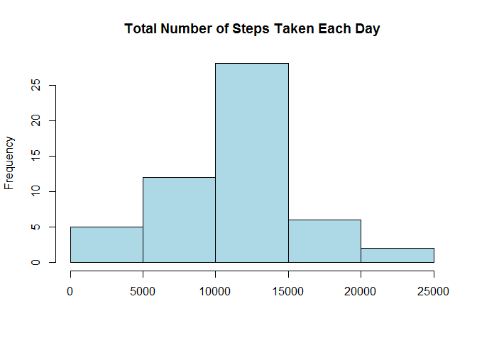
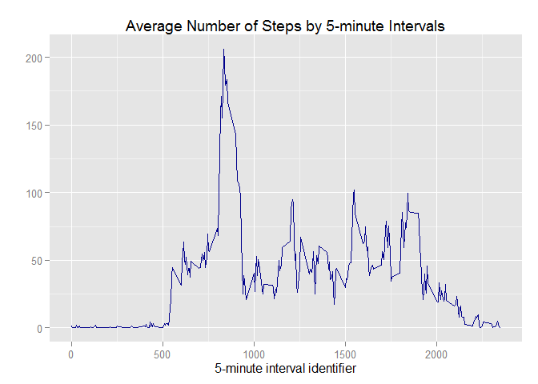
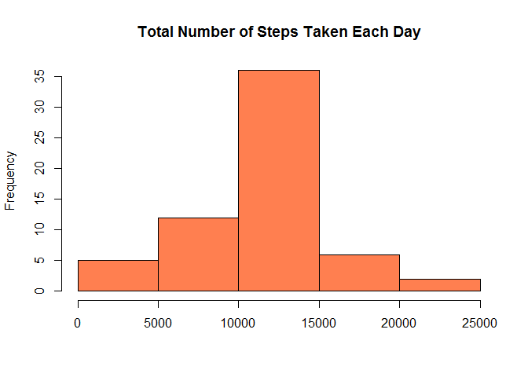
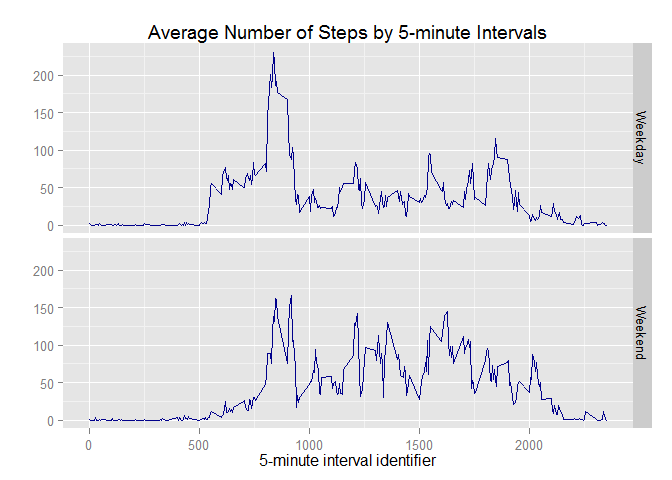

# Reproducible Research: Peer Assessment 1

This assignment makes use of data from a personal activity monitoring device.
This device collects data at 5 minute intervals through out the day. The data consists of two months of data from an anonymous individual collected during
the months of October and November, 2012 and include the number of steps
taken in 5 minute intervals each day.

## Loading and preprocessing the data

1. Load the data (i.e. read.csv())

Set working directory with setwd() same as the directory of the data and
load the dataset into R.


```r
activity <- read.csv("activity.csv")
str(activity)
```

```
## 'data.frame':	17568 obs. of  3 variables:
##  $ steps   : int  NA NA NA NA NA NA NA NA NA NA ...
##  $ date    : Factor w/ 61 levels "2012-10-01","2012-10-02",..: 1 1 1 1 1 1 1 1 1 1 ...
##  $ interval: int  0 5 10 15 20 25 30 35 40 45 ...
```

2. Process/transform the data (if necessary) into a format suitable for your
analysis

Convert date column (factor class) to date class.


```r
activity$date <- as.Date(activity$date)
str(activity)
```

```
## 'data.frame':	17568 obs. of  3 variables:
##  $ steps   : int  NA NA NA NA NA NA NA NA NA NA ...
##  $ date    : Date, format: "2012-10-01" "2012-10-01" ...
##  $ interval: int  0 5 10 15 20 25 30 35 40 45 ...
```

The variables included in this dataset are:

- steps: Number of steps taking in a 5-minute interval (missing values are
coded as NA)
- date: The date on which the measurement was taken in YYYY-MM-DD
format
- interval: Identifier for the 5-minute interval in which measurement was
taken

## What is mean total number of steps taken per day?

For this part of the assignment, the missing values in the dataset are ignored.

Let's omit the missing values in the dataset and create/save a new dataset "daysteps" with total number of steps taken each day.


```r
library(plyr)
daysteps <- ddply(na.omit(activity), .(date), summarize, totalsteps=sum(steps))
str(daysteps)
```

```
## 'data.frame':	53 obs. of  2 variables:
##  $ date      : Date, format: "2012-10-02" "2012-10-03" ...
##  $ totalsteps: int  126 11352 12116 13294 15420 11015 12811 9900 10304 17382 ...
```

1. Make a histogram of the total number of steps taken each day


```r
hist(daysteps$totalsteps, main="Total Number of Steps Taken Each Day", col="lightblue", xlab=NULL)
```

 

2. Calculate and report the mean and median total number of steps taken
per day


```r
mean(daysteps$totalsteps)
```

```
## [1] 10766.19
```

```r
median(daysteps$totalsteps)
```

```
## [1] 10765
```

The mean is 10766.19 and the median is 10765.

## What is the average daily activity pattern?

Let's omit the missing values in the dataset and create a new dataset "intsteps" with average number of steps (averaged across all days) by 5-minute intervals.


```r
intsteps <- ddply(na.omit(activity), .(interval), summarize, msteps=mean(steps))
```

1. Make a time series plot (i.e. type = "l") of the 5-minute interval (x-axis)
and the average number of steps taken, averaged across all days (y-axis)


```r
library(ggplot2)
g <- ggplot(intsteps, aes(interval, msteps))
g+geom_line(color="darkblue")+labs(x="5-minute interval identifier", y="", title="Average Number of Steps by 5-minute Intervals")
```

 

2. Which 5-minute interval, on average across all the days in the dataset,
contains the maximum number of steps?

Let's sort the data in descending order and check the first row.


```r
intsteps <- arrange(intsteps, desc(msteps))
head(intsteps, 1)
```

```
##   interval   msteps
## 1      835 206.1698
```

```r
intsteps[1,"interval"]
```

```
## [1] 835
```

The 5-minute interval with identifier "835" contains the maximum number of steps (which is 206.1698) on average across all the days.

## Imputing missing values

Note that there are a number of days/intervals where there are missing values
(coded as NA). The presence of missing days may introduce bias into some
calculations or summaries of the data.

1. Calculate and report the total number of missing values in the dataset
(i.e. the total number of rows with NAs)


```r
dataNA <- is.na(activity)
sum(dataNA)
```

```
## [1] 2304
```

There are 2304 missing values in the dataset.

2. Devise a strategy for filling in all of the missing values in the dataset. The
strategy does not need to be sophisticated. For example, you could use
the mean/median for that day, or the mean for that 5-minute interval, etc.

Let's merge the original dataset "activity" with dataset "intsteps" containing average number of steps by 5-minute intervals (averaged across all days).


```r
newdata <- merge(activity, intsteps, by.x="interval")
```

Then, fill in the missing values using the the mean for corresponding 5-minute interval.


```r
i <- which(is.na(newdata$steps))
j <- length(i)
for (n in 1:j) {
        newdata[i[n],"steps"] <- newdata[i[n],"msteps"]
}
```

3. Create a new dataset that is equal to the original dataset but with the
missing data filled in.

The new dataset "newdata" is created above in the second step.


```r
str(newdata)
```

```
## 'data.frame':	17568 obs. of  4 variables:
##  $ interval: int  0 0 0 0 0 0 0 0 0 0 ...
##  $ steps   : num  1.72 0 0 0 0 ...
##  $ date    : Date, format: "2012-10-01" "2012-11-23" ...
##  $ msteps  : num  1.72 1.72 1.72 1.72 1.72 ...
```

4. Make a histogram of the total number of steps taken each day and Calculate
and report the mean and median total number of steps taken per day. 


```r
newdaysteps <- ddply(newdata, .(date), summarize, totalsteps=sum(steps))
```


```r
hist(newdaysteps$totalsteps, main="Total Number of Steps Taken Each Day", col="coral", xlab=NULL)
```

 


```r
mean(newdaysteps$totalsteps)
```

```
## [1] 10766.19
```

```r
median(newdaysteps$totalsteps)
```

```
## [1] 10766.19
```

Do these values differ from the estimates from the first part of the assignment?
What is the impact of imputing missing data on the estimates of the total
daily number of steps?

The mean value (10766.19) is the same as the estimate from the first part of the assignment (which was also 10766.19). The median is also 10766.19, which was found as 10765 in the first part of the assignment. The difference in the median estimates from these two methods (only 1.19) is negligible. 

When we imput missing data, we find that mean and median are equal to each other.

## Are there differences in activity patterns between weekdays and weekends?

Use the dataset with the filled-in missing values for this part.

1. Create a new factor variable in the dataset with two levels - "weekday"
and "weekend" indicating whether a given date is a weekday or weekend
day.


```r
newdata$weekday <- weekdays(newdata$date)
newdata$type <- ifelse(newdata$weekday=="Saturday" | newdata$weekday=="Sunday", "Weekend", "Weekday")
newdata$type <- factor(newdata$type)
```

2. Make a panel plot containing a time series plot (i.e. type = "l") of the
5-minute interval (x-axis) and the average number of steps taken, averaged
across all weekday days or weekend days (y-axis).


```r
typesteps <- ddply(newdata, ~interval + type, summarize, tmsteps=mean(steps))

library(ggplot2)
g <- ggplot(typesteps, aes(interval, tmsteps))
g+geom_line(color="darkblue")+facet_grid(type~.)+labs(x="5-minute interval identifier", y="", title="Average Number of Steps by 5-minute Intervals")
```

 


